# CloudCast Mixer User Manual

CloudCast Mixer is an **AES67 8-bus broadcast mixer**: a realtime audio engine and its
browser control surface, run as one service on Linux — on hardware, in EC2, or in a
container. The desk has **16 faders**, four programme buses (**PGM 1–4**), four auxiliary
buses (**AUX 1–4**), a **per-fader mix-minus** for every channel, and **cue/PFL** with
monitoring in the operator's own browser.

This manual is for the person installing and driving the desk. It covers installation on
Docker and on bare metal, then every panel of the control surface: the channel strip,
mix-minus and backfeeds, sources and discovery, outputs, console profiles, the clock,
intercom, physical control surfaces and the rack panel.

Everything an operator touches on this desk is also available over REST and WebSocket, so
anything this manual shows can be automated.

---

## Contents

1. [Core concepts](#1-core-concepts)
   - [The desk at a glance](#the-desk-at-a-glance) · [Sources, streams and channels](#sources-streams-and-channels) · [**Buses**](#buses)
2. [Installing](#2-installing)
   - [What it runs on](#what-it-runs-on) · [**Running the container**](#running-the-container) · [**Going on air — the realtime privileges**](#going-on-air-the-realtime-privileges) · [The host firewall](#the-host-firewall) · [The PTP hardware clock](#the-ptp-hardware-clock) · [Checking the launch](#checking-the-launch) · [Docker Compose](#docker-compose) · [Bare metal](#bare-metal) · [Master and backup](#master-and-backup) · [Environment reference](#environment-reference)
3. [Getting started](#3-getting-started)
   - [Signing in](#signing-in) · [The surface](#the-surface) · [The header status row](#the-header-status-row)
4. [The channel strip](#4-the-channel-strip)
   - [Patching a source](#patching-a-source) · [Trim, pan and balance](#trim-pan-and-balance) · [**PGM assign**](#pgm-assign) · [The fader and the meter](#the-fader-and-the-meter) · [ON and CUE](#on-and-cue) · [Aux sends](#aux-sends) · [Strip badges](#strip-badges)
5. [Banks](#5-banks)
6. [The main meter and the monitor](#6-the-main-meter-and-the-monitor)
   - [Main meter](#main-meter) · [Headphones](#headphones) · [**Cue modes**](#cue-modes) · [Bus trims](#bus-trims)
7. [Cue and PHONES](#7-cue-and-phones)
8. [Processing](#8-processing)
   - [EQ](#eq) · [De-ess](#de-ess) · [Dynamics](#dynamics)
9. [Mix-minus and backfeeds](#9-mix-minus-and-backfeeds)
10. [Sources](#10-sources)
    - [Configured sources](#configured-sources) · [Discovered on the network](#discovered-on-the-network) · [Adding a source manually](#adding-a-source-manually)
11. [Outputs](#11-outputs)
12. [Console profiles](#12-console-profiles)
    - [**What a profile contains**](#what-a-profile-contains) · [Saving](#saving) · [**Recalling is safe**](#recalling-is-safe) · [Managing the list](#managing-the-list)
13. [Clock](#13-clock)
14. [Intercom](#14-intercom)
15. [Control surfaces](#15-control-surfaces)
16. [The rack panel](#16-the-rack-panel)
17. [Accounts, roles and security](#17-accounts-roles-and-security)
18. [Themes](#18-themes)

---

## 1. Core concepts

### The desk at a glance

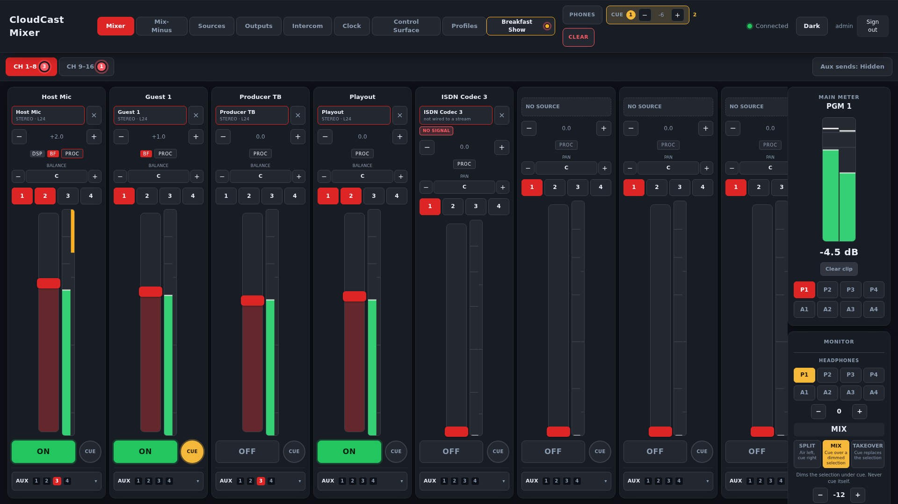

One service runs both halves of the product: the **engine**, a realtime audio process that
mixes AES67 streams sample-exactly, and the **control surface**, the browser page in front
of you. The surface never carries audio to air — closing the browser changes nothing on
the plant. The one exception is deliberate: **PHONES** plays the cue bus *into your
browser*, so you can pre-fade listen from wherever you are sitting ([§7](#7-cue-and-phones)).

### Sources, streams and channels

Three ideas, in one direction:

| Thing | What it is | Where it is managed |
|---|---|---|
| **Stream** | An AES67 endpoint — a multicast address the desk receives or transmits | Sources tab (receive), Outputs tab (transmit) |
| **Source** | A named thing you can put on a fader — "Host Mic", "Playout" — wired to a receive stream, carrying its own processing, backfeed and bus permissions | Sources tab |
| **Channel** | One of the 16 faders, with a source patched to it | Mixer tab |

A fader's label is the name of the source patched to it. Processing and backfeed belong to
the **source**, so they follow it onto whichever fader it is patched to.

### Buses

Eight mix buses, in two families:

- **PGM 1–4** — programme buses. Every channel taps them **post-fader**: the fader and the
  ON switch always govern what reaches programme.
- **AUX 1–4** — auxiliary buses, fed by per-channel **aux sends** with their own level and
  a selectable tap point ([§4](#aux-sends)). Auxes carry mix-minus returns, IFB, FX — anything
  that is not programme.

Each bus has a label, a master gain, and (once bound on the Outputs tab) an AES67 transmit
stream. Beside the eight buses there is one **cue** bus ([§7](#7-cue-and-phones)) and a
**headphones** monitor selection ([§6](#6-the-main-meter-and-the-monitor)).

---

## 2. Installing

### What it runs on

**Linux x86_64 with glibc 2.35 or newer** — Ubuntu 22.04+, Debian 12+, RHEL 9+, or the
container image on anything that runs Docker. There is no Windows target, by design. Two
ways to install:

- **The container image** — the engine, the built control surface, and a start-up
  capability check in one image. Distributed through Docker Hub as
  `cloudcastsystems/cloudcast-mixer` (access is granted with your licence).
- **The release archive** — one static-free binary (`ccmix-server`), the surface bundle
  it serves, and the systemd/udev files a bare-metal install needs.

### Running the container

The default transport is `null`: the whole desk runs with no privileges, no network
requirements and no audio hardware — the right first run on any machine, and enough for
everything in this manual except audio actually arriving.

```bash
docker login       # an account with access to the image
docker run -d --name ccmix \
  -p 8080:8080 \
  -v ccmix-profiles:/var/lib/ccmix \
  -e CCMIX_BOOTSTRAP_PASSWORD='choose-a-password' \
  cloudcastsystems/cloudcast-mixer:latest
```

Open `http://<host>:8080` and sign in as **admin** ([§3](#3-getting-started)).

**The volume is not optional.** Console profiles — every saved desk — live in
`/var/lib/ccmix`. Run without the volume and they die with the container. If
`CCMIX_BOOTSTRAP_PASSWORD` is not set, a password is generated and printed once in the
container log (`docker logs ccmix`) — it is stored hashed and cannot be recovered later.

### Going on air — the realtime privileges

On a plant network the container needs the host's network namespace and two realtime
ulimits:

```bash
docker run -d --name ccmix \
  --network host \
  --ulimit rtprio=3 --ulimit memlock=-1 \
  -v ccmix-profiles:/var/lib/ccmix \
  -e CCMIX_TRANSPORT=aes67 \
  -e CCMIX_INTERFACE=<plant-iface> \
  -e CCMIX_REQUIRE_CAPABILITIES=1 \
  cloudcastsystems/cloudcast-mixer:latest
```

- **`--network host`** — multicast RTP, SAP and PTP do not traverse Docker's bridge. A
  bridged container starts, serves the surface, and looks entirely healthy — and hears
  nothing. This was measured, not assumed. The cost: the desk's ports are now host
  ports; move `CCMIX_HTTP_PORT` if 8080 is taken.
- **`--ulimit rtprio=3 --ulimit memlock=-1`** — grant the audio thread `SCHED_FIFO`
  scheduling and lock the mixer's memory against paging. Do **not** substitute
  `--cap-add=SYS_NICE`: a capability added to a non-root container never becomes
  effective, and this image runs unprivileged. The ulimits are simultaneously the
  working answer and the smaller privilege.
- **`CCMIX_REQUIRE_CAPABILITIES=1`** — in production the mixer should refuse to start
  rather than run degraded in a way nobody notices until it is on air.

Without a stream configured the desk transmits nothing and joins nothing; SAP discovery
and announcement are separate opt-ins ([environment reference](#environment-reference)).

### The host firewall

A host-networked container is subject to the **host's** firewall, and the failure is
silent in the worst way: the multicast join succeeds, the switch forwards the traffic,
`tcpdump` shows it arriving — and the socket never sees it. On a ufw host, admit the
AES67 and PTP groups on the media interface:

```bash
sudo ufw allow in on <plant-iface> to 239.0.0.0/8 comment 'AES67 RTP + SAP'
sudo ufw allow in on <plant-iface> to 224.0.1.129 comment 'PTP'
```

### The PTP hardware clock

Without a PHC the media clock falls back to the system clock, and the desk's Clock tab
([§13](#13-clock)) says so rather than implying lock. Passing `--device /dev/ptp0` alone is
**not** enough — the node is `root:root 0600` on the host, so the unprivileged mixer gets
a device it cannot open. Install the udev rule on the host:

```
# /etc/udev/rules.d/70-ccmix-ptp.rules
SUBSYSTEM=="ptp", GROUP="ccmix-ptp", MODE="0660"
```

then add to the run command:

```bash
--device /dev/ptp0 --group-add <gid-of-ccmix-ptp>
```

Use the PHC of the interface AES67 actually uses — read it from
`/sys/class/net/<iface>/device/ptp/`. A readable PHC on a different NIC disciplines
nothing, and the start-up check says so.

### Checking the launch

The image ships `ccmix-preflight`, which **proves** each privilege was granted — it runs
`chrt`, opens the PHC, inspects the network namespace — rather than inferring from flags.
Run it with the exact flags you deploy with:

```bash
docker run --rm --network host --ulimit rtprio=3 --ulimit memlock=-1 \
  -e CCMIX_TRANSPORT=aes67 -e CCMIX_INTERFACE=<plant-iface> \
  cloudcastsystems/cloudcast-mixer:latest ccmix-preflight
```

One line per requirement — `ok`, `DEGRADED` with the flag that fixes it, or `info`. It
also runs automatically at every container start. The container's health check goes
`healthy` once the desk actually answers through its own web port.

### Docker Compose

The repository's `deploy/docker/docker-compose.yml` is the same deployment as above with
the reasoning inline — host networking, the two ulimits, `cap_drop: ALL`,
`no-new-privileges`, the profiles volume, and the commented-out PTP passthrough ready to
enable. `docker compose -f deploy/docker/docker-compose.yml up` and edit from there.

### Bare metal

The release archive contains:

```
ccmix-server        the mixer and its control plane — no runtime dependencies
web/                the control surface, built against the real backend
systemd/            unit files for a bare-metal install
udev/               the rule that makes /dev/ptp* reachable by an unprivileged mixer
```

Check what you have before you run it — both answers come from the binary itself,
offline:

```bash
./ccmix-server --version
./ccmix-server --verify-surface ./web
```

The second matters: a surface bundle can be built against an in-process mock, and a mock
build *looks like a working desk* while reaching no mixer at all. The server performs the
same verification at every start and refuses to serve a mock bundle.

Install the binary and bundle, point `CCMIX_WEB_ROOT` at the bundle, set `CCMIX_BIND`,
and use the shipped systemd unit — it carries the same realtime grants
(`LimitRTPRIO`/`LimitMEMLOCK`) the container expresses as ulimits.

### Master and backup

A master and its backup must never both feed the plant. Start the backup with
`CCMIX_SUPPRESS_EXTERNAL_OUTPUTS=1`: it runs the same desk, but announces nothing and
double-fires nothing. The setting fails towards silence — anything but an explicit
0/false/no/off suppresses.

### Environment reference

| Variable | Default | What it does |
|---|---|---|
| `CCMIX_BIND` | `127.0.0.1:8080` | Address the desk serves on (bare metal; the container exposes `CCMIX_HTTP_PORT`, default `8080`) |
| `CCMIX_TRANSPORT` | `null` | `null` for a desk off the network, `aes67` for the plant |
| `CCMIX_INTERFACE` | — | The plant interface, by name or address. Required for `aes67`; the mixer refuses to start if it does not exist rather than starting deaf |
| `CCMIX_WEB_ROOT` | auto | Where the surface bundle is served from; the container ships its own |
| `CCMIX_PROFILES` | `ccmix-profiles.sqlite` | The console-profile database — the state worth backing up |
| `CCMIX_AUTH_DB` | `ccmix-auth.sqlite` | Accounts and sessions |
| `CCMIX_BOOTSTRAP_PASSWORD` | generated | The first `admin` password; unset means generated and printed once |
| `CCMIX_DISCOVERY` / `CCMIX_ANNOUNCE` | off | Set to `sap` to hear / describe plant sessions (each with its own `…_INTERFACE`) |
| `CCMIX_SUPPRESS_EXTERNAL_OUTPUTS` | off | Set `1` on a backup — see above |
| `CCMIX_REQUIRE_CAPABILITIES` | `0` | Set `1` in production: refuse to start degraded |
| `CCMIX_REALTIME` | attempt | `off` / `attempt` / `require` — what the binary does about `SCHED_FIFO` and `mlockall` |
| `CCMIX_LINK_OFFSET_MS`, `CCMIX_PACKET_TIME_US` | AES67 defaults | Receive link offset and packet time |
| `RUST_LOG` | `info` | Log level |

---

## 3. Getting started

### Signing in

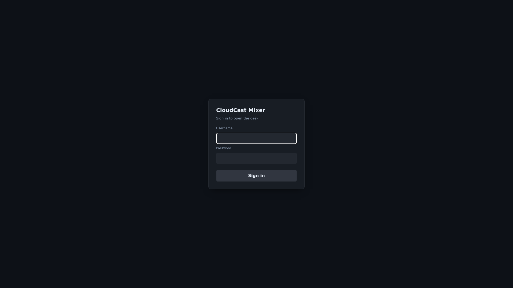

Browse to the desk's address and sign in. The lead reads **Sign in to open the desk.** —
enter **Username** and **Password** and press **Sign in**.

A fresh installation has one account, **admin**. Its password is either the value the
deployment set (`CCMIX_BOOTSTRAP_PASSWORD`) or a generated one printed once in the
server's log at first start — it is stored hashed and cannot be recovered, only reset.
Five failed attempts lock the account; sessions last 12 hours.

### The surface

Across the top, eight tabs: **Mixer**, **Mix-Minus**, **Sources**, **Outputs**,
**Intercom**, **Clock**, **Control Surface**, **Profiles**. Everything in this manual
lives under one of them. The **Mixer** tab is the desk itself: the channel strips in two
banks of eight, with the main meter and monitor section on the right.

### The header status row

The right side of the header is always visible, whatever tab you are on:

| Control | What it tells you |
|---|---|
| **PHONES** | Plays the cue bus in this browser ([§7](#7-cue-and-phones)) |
| **CUE** counter and level | How many channels are cued, and the cue master level; **CLEAR** drops every engagement |
| Profile badge | The active profile's name; its dot lights when the desk differs from what was last saved ([§12](#12-console-profiles)) |
| **Connected** | The live WebSocket to the desk. **Connecting…** means the surface is not currently talking to the mixer — what you see may be stale |
| **Dark** / **Light** | The desk's own theme toggle ([§18](#18-themes)) |
| Account badge | Who you are signed in as, a **read-only** chip if your role cannot operate the desk, and **Sign out** |

---

## 4. The channel strip

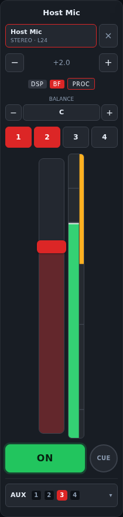

Top to bottom, every strip is the same instrument.

### Patching a source

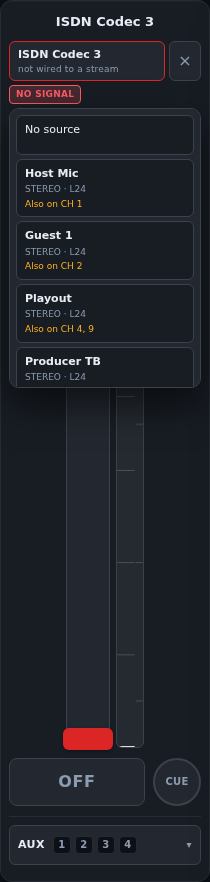

The button under the strip's name shows the patched source (or **NO SOURCE**). Click it to
open the picker and choose from the configured sources ([§10](#10-sources)); the **×** beside it
clears the patch. Under the source name the strip shows the wire format — e.g.
**STEREO · L24** — or **not wired to a stream** for a source with no stream yet.

Two health badges can appear here, and they mean different things:

- **NO SIGNAL** — the desk is not receiving the source's stream at all.
- **STALLED — audio thread late** — packets are arriving but the audio engine is not
  keeping up. On a correctly deployed mixer this indicates the host is starving the
  realtime thread — see the realtime privileges in [§2](#going-on-air-the-realtime-privileges).

### Trim, pan and balance

The stepper under the source sets **input trim**, −20 to +20 dB — gain before everything
else on the strip. Below the badges, a mono source gets **Pan** and a stereo source gets
**Balance**; the centre button returns it to **C**.

### PGM assign

The four numbered buttons **1 2 3 4** assign the channel to PGM 1–4. Lit red means
assigned. A source's configuration can forbid particular buses ([§10](#configured-sources)); a
forbidden assignment renders disabled with the reason in its tooltip.

### The fader and the meter

The fader sets the channel's level into every post-fader destination. Beside it, the
channel meter draws the source's level — peak with a true-peak tick — and, when the
source's processing is engaged, a narrow **gain-reduction** column alongside
([§8](#8-processing)). Meters update 25 times a second and read down to −50 dBFS.

### ON and CUE

**ON** puts the channel on air — it is the switch between the fader and every destination.
**OFF** is not a mute button on a live path so much as the channel not being open at all:
backfeeds can switch what they return based on it ([§9](#9-mix-minus-and-backfeeds)).

**CUE** engages pre-fade listen on the cue bus — see [§7](#7-cue-and-phones). While the desk
confirms the engagement the button shows a dashed ring; solid means the engine has it.

### Aux sends

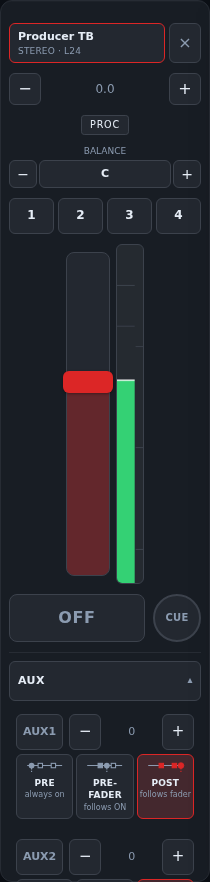

The **AUX** row at the strip's foot expands into one row per aux bus. Each send has an
enable, a level (−60 to +10 dB), and a **tap point**:

| Tap | Face | Behaviour |
|---|---|---|
| Pre | **PRE** | *always on* — feeds the aux regardless of the fader and the ON switch |
| Pre-fader | **PRE-FADER** | *follows ON* — open whenever the channel is on, at send level |
| Post | **POST** | *follows fader* — the send follows the fader and ON, like programme does |

**PRE** is the tap for mix-minus returns — the far end keeps hearing the studio even when
their own fader is closed. The **Aux sends: Shown / Hidden** toggle on the toolbar opens
and closes the section on every strip at once.

### Strip badges

| Badge | Meaning |
|---|---|
| **DSP** | The source's processing is engaged (not bypassed) — [§8](#8-processing) |
| **BF** | This fader carries the source's backfeed return — [§9](#9-mix-minus-and-backfeeds) |
| **BF→3** | The source's backfeed is carried by another fader (here, fader 3) |
| **PROC** | Opens the processing dialog |

---

## 5. Banks


The desk's 16 faders present as two banks: **CH 1–8** and **CH 9–16**. A badge on the
unselected bank counts its channels that are ON, so a live microphone can never hide
behind the bank you are not looking at — the badge turns red when any of them is assigned
to programme (on air), and its tooltip counts both states.

---

## 6. The main meter and the monitor

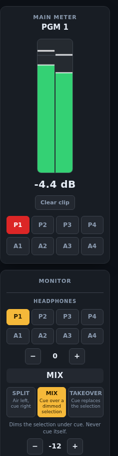

### Main meter

The **MAIN METER** draws one bus, stereo, with a numeric peak readout beneath. The
**P1–P4 / A1–A4** selector chooses which bus it follows. A clip latches at the top of the
scale until **Clear clip** is pressed — a clip that happened while you looked away still
shows.

### Headphones

**HEADPHONES** selects what you monitor — any PGM or AUX bus — with its own level stepper.
This is the monitor selection the cue system plays against.

### Cue modes

How cue interacts with your monitoring, selectable as three modes:

| Mode | Face | Behaviour |
|---|---|---|
| Split | **SPLIT** | *Air left, cue right* |
| Mix | **MIX** | *Cue over a dimmed selection* — the dim depth stepper appears below, and dims **the selection under cue. Never cue itself.** |
| Takeover | **TAKEOVER** | *Cue replaces the selection* |

### Bus trims

**BUS TRIMS** gives every one of the eight buses a master gain stepper (−20 to +20 dB)
without leaving the desk.

---

## 7. Cue and PHONES


Pressing a strip's **CUE** puts that channel, pre-fade, on the cue bus. The header shows
the count of engaged channels, the **CUE** master level stepper (−60 to +10 dB), and
**CLEAR**, which drops every engagement at once.

**PHONES** plays the cue bus *in this browser* — the one place the surface carries audio.
Browsers hold audio until the page has been interacted with; if you press **PHONES**
before touching anything else the desk shows **The browser is holding audio until you
interact with the page.** with a retry button.

Cue engagement and the cue master are **runtime state, not profile state**: a restart or a
profile recall comes up with nothing in the headphones, deliberately.

---

## 8. Processing

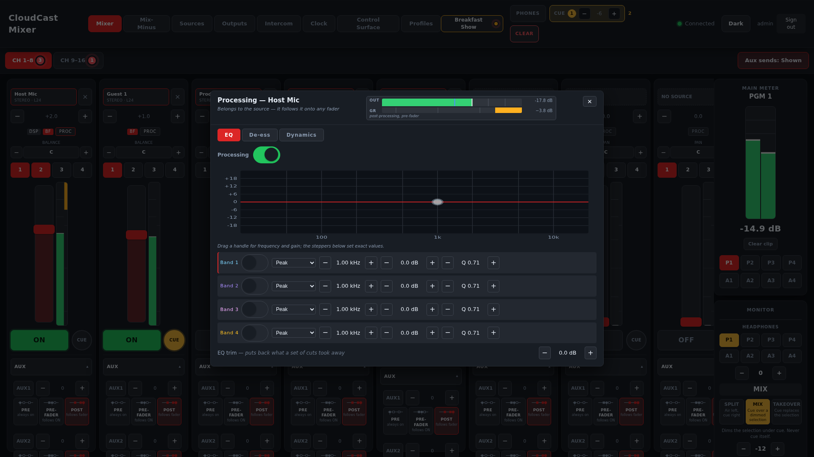

Each source carries its own processing chain, opened with the strip's **PROC** button. The
dialog's subtitle states the model: **Belongs to the source — it follows it onto any
fader.** Its header meters show the processed output (**OUT**) and gain reduction
(**GR**) live. Three tabs: **EQ**, **De-ess**, **Dynamics**.

### EQ

Parametric EQ with a draggable response curve. Each band selects its type — **Peak**,
**Low shelf**, **High shelf**, **High-pass**, **Low-pass** — with frequency, gain and Q,
plus an overall trim.

### De-ess

A dedicated de-esser with the usual threshold and frequency-region controls.

### Dynamics

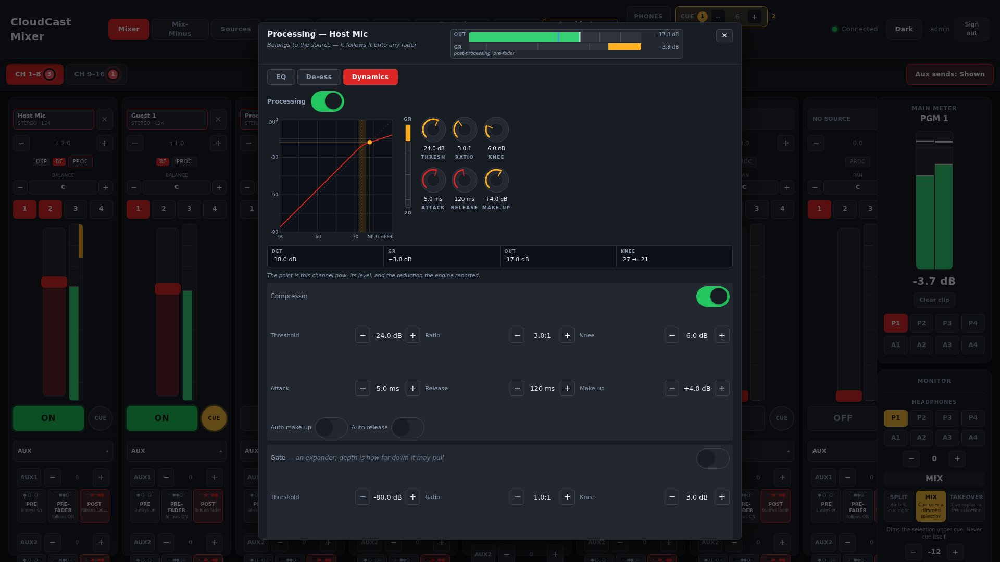

**Compressor** and **Gate**, each with an enable, threshold, ratio, knee, attack, release
and make-up, with **Auto make-up** and **Auto release** options; the limiter lives at the
end of the same tab. While the compressor works, the strip's meter grows its
gain-reduction column and the strip shows the **DSP** badge.

---

## 9. Mix-minus and backfeeds

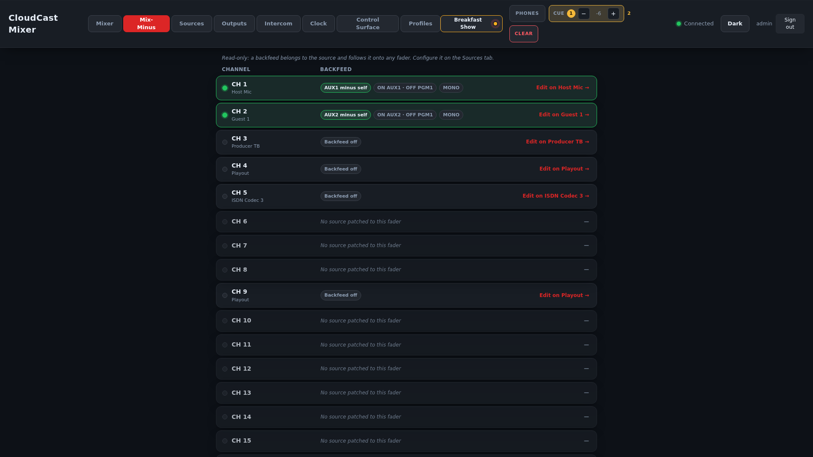

Every fader has a mix-minus feed: a return to the far end that is *everything minus
themselves*, derived sample-exactly so a caller never hears their own voice late. The
**Mix-Minus** tab is the desk-wide view — one row per channel showing the source patched,
the bus the return is derived from **now**, the configured **ON x · OFF y** pair,
**MONO**/**STEREO**, and **Backfeed off** or **No source patched to this fader** where
that is the state.

The configuration itself belongs to the **source** — the row's **Edit on …** button jumps
to it on the Sources tab. A backfeed configures:

- the bus the return derives from while the fader is **ON** (typically the aux carrying
  the studio's mix-minus),
- an optional different bus while the fader is **OFF** (typically programme, so a
  contributor waiting to come on hears air),
- mono or stereo, and the transmit stream that carries it back.

Because the mix-minus subtracts with the same per-sample ramps as the bus sum, the
cancellation holds *during* fader moves, not just at rest.

---

## 10. Sources

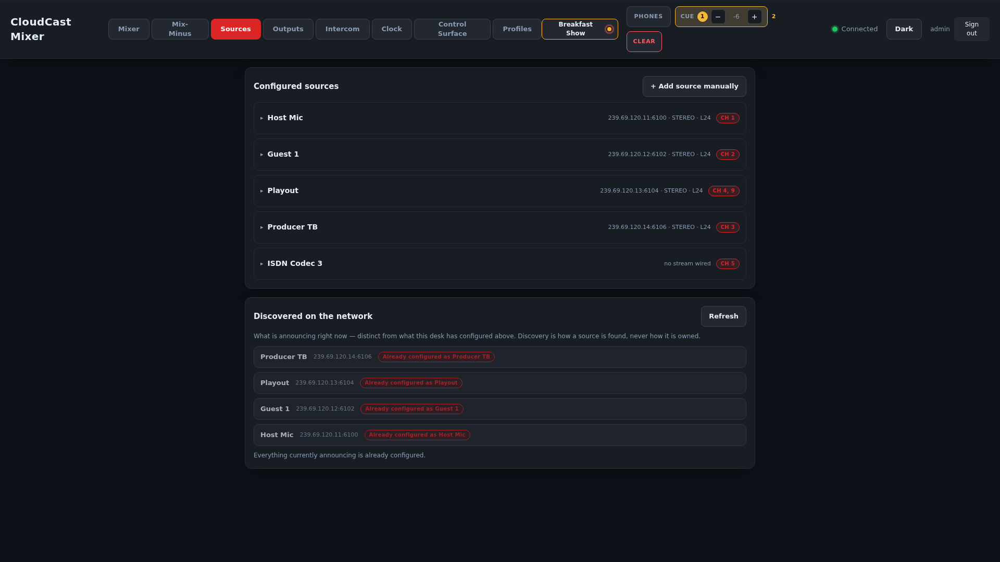

### Configured sources

**Configured sources** is the desk's own list — everything that can be patched to a
fader. Each row shows the wire (address, **STEREO · L24**, …) and a **CH n** chip naming
the fader(s) it is patched to, or **no stream wired** for a placeholder. Expanding a row
opens its four sections: **Name**, **Permitted buses**, **Backfeed**, **Processing**.

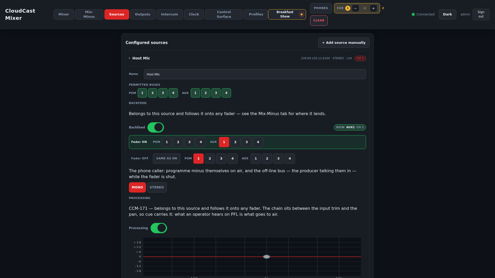

**Permitted buses** restricts which buses the source may be assigned to — a talkback
microphone that must never reach programme is enforced here, and the strip's forbidden
PGM buttons render disabled with the reason. A source that is configured but not
currently announcing on the network wears a **NOT ANNOUNCING** badge. **Delete source**
is refused while the source is patched to any fader.

### Discovered on the network

**Discovered on the network** lists what is announcing right now over SAP. The panel's own
hint states the model: discovery is how a source is *found*, never how it is *owned*.
**Promote to source** turns an announcement into a configured source with one click and a
name; announcements that match something already configured say so. **Refresh** re-asks.

### Adding a source manually

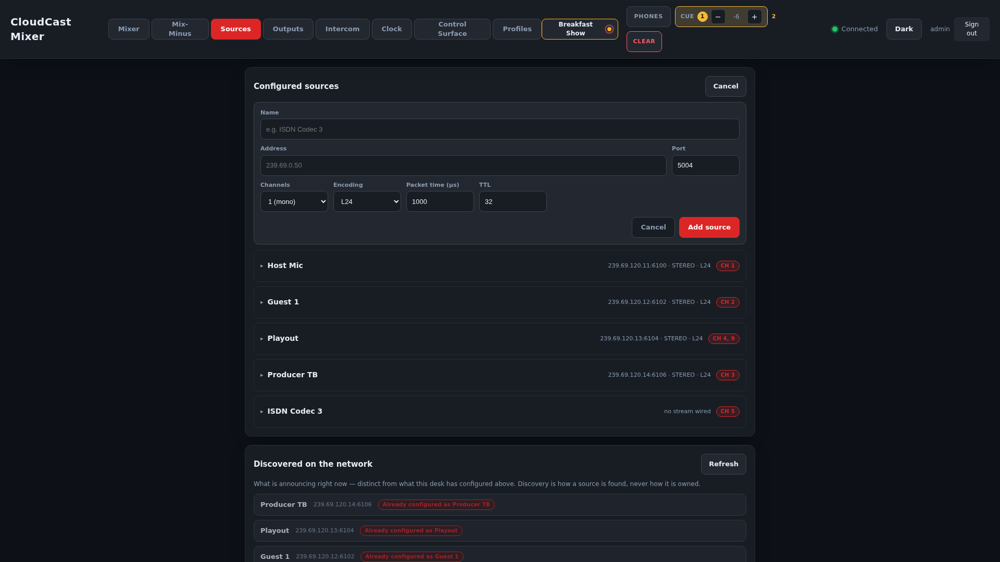

**+ Add source manually** is for endpoints that do not announce — an ISDN codec, a fixed
encoder. Fields: **Name**, **Address**, **Port**, **Channels** (**1 (mono)** / **2
(stereo)**), **Encoding** (**L24**/**L16**), **Packet time (µs)**, **TTL**.

---

## 11. Outputs

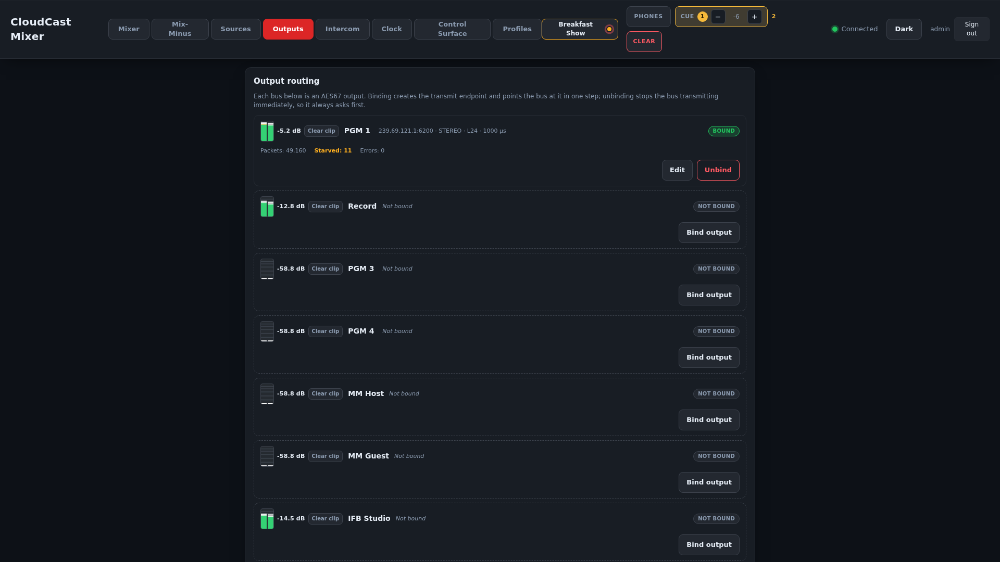

**Output routing** is where buses become AES67 transmit streams. The panel's hint is the
contract: binding creates the transmit endpoint and points the bus at it in one step;
unbinding stops the bus transmitting immediately, so it always asks first.

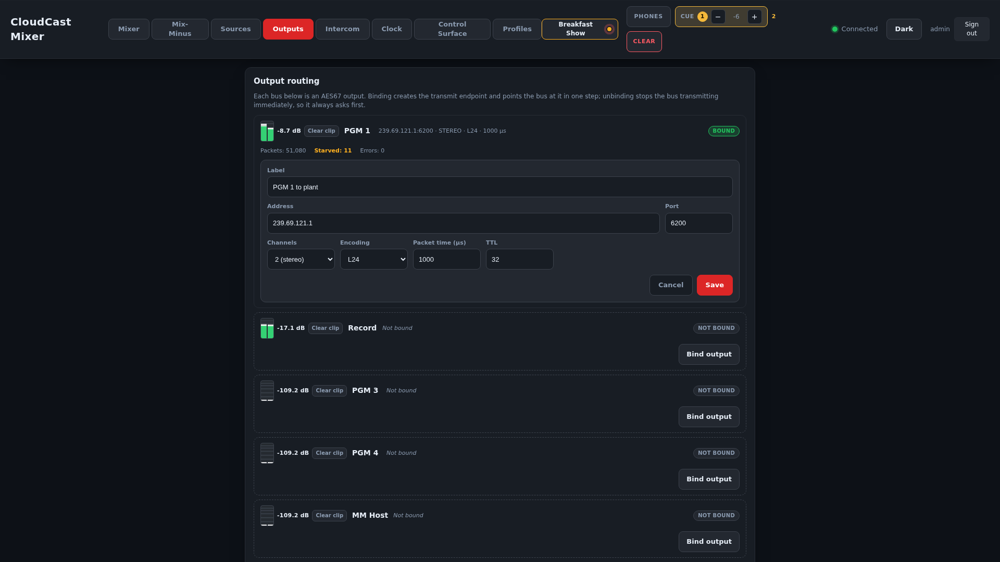

Each row carries a compact meter and transmit health — packets, starvation, errors. The
bind form takes **Label**, **Address**, **Port**, **Channels**, **Encoding**, **Packet
time (µs)**, **TTL**. Unbinding warns in place — **Unbinding will stop … transmitting
to …** — and waits for confirmation.

**Monitor outputs** gives the **cue** bus and the **headphones** selection their own
transmit streams, for a physical monitor feed in the studio.

---

## 12. Console profiles

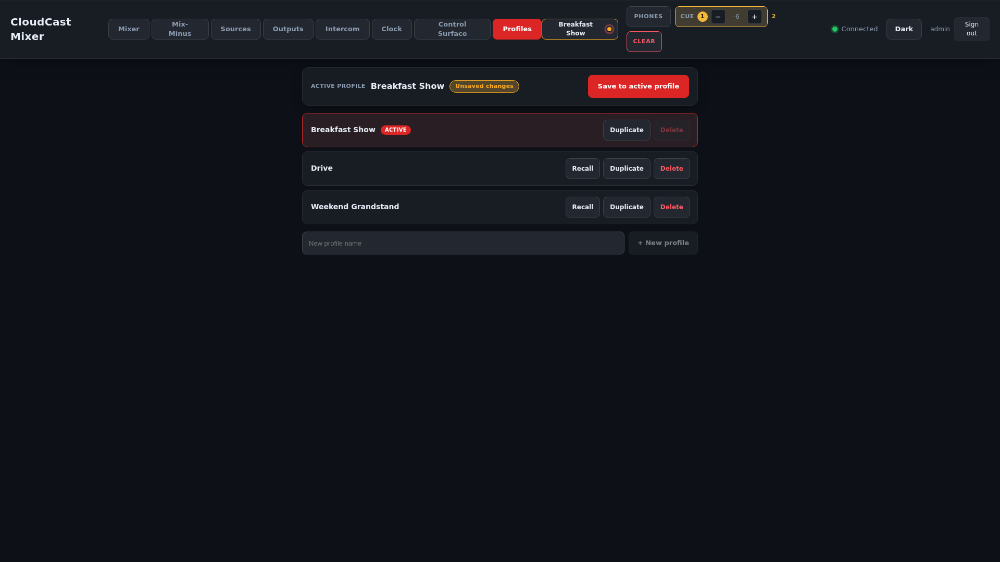

### What a profile contains

A profile is the desk's setup for a show: source configuration, labels, trims, PGM
assignments, aux sends and tap points, backfeeds, bus labels and trims. Operators switch
profiles between programmes and expect the desk to come back exactly as they left it.

Two kinds of state are deliberately **not** in a profile:

- **Performance** — fader positions, ON states, cue engagements. These reset on load, for
  the same reason they reset on restart.
- **Machine-local** — stream addresses and bindings, interface names, clock
  configuration, accounts. A profile is portable between mixers; anything that would
  break when carried to another machine is kept out of it.

### Saving

The bar names the **Active profile** and tracks **Unsaved changes** / **Saved** — the
same state as the header badge's dot. **Save to active profile** writes the desk as it is
now. There is no autosave: the desk you shaped during a show does not overwrite the
profile behind you unless you say so.

### Recalling is safe

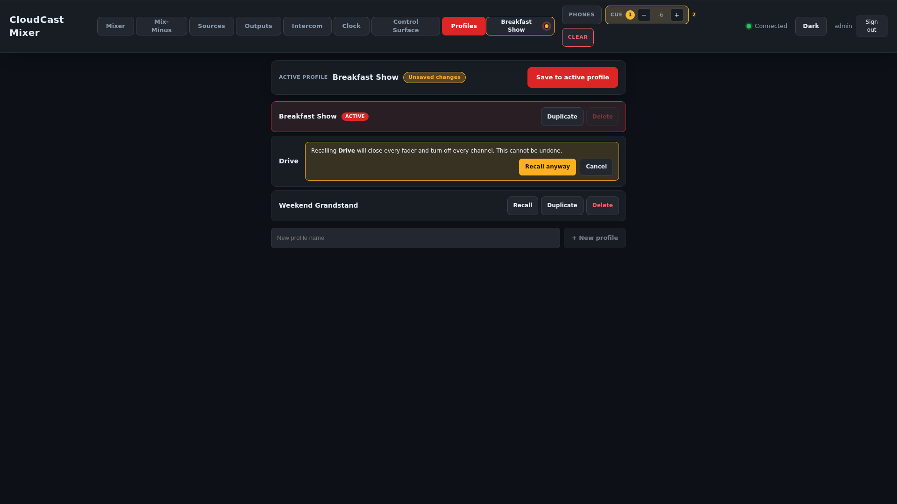

**Recall** activates another profile — after a confirmation (**Recall anyway** /
**Cancel**) if the desk has unsaved changes. A recall **never puts audio to air**: the
desk comes up with every fader closed and every channel off, so recalling mid-programme
cannot surprise you with an open microphone.

### Managing the list

**+ New profile** creates one at factory settings; each row offers **Recall**,
**Duplicate**, **Delete** and inline rename. The active profile and the last remaining
profile cannot be deleted, and the rows say so.

---

## 13. Clock

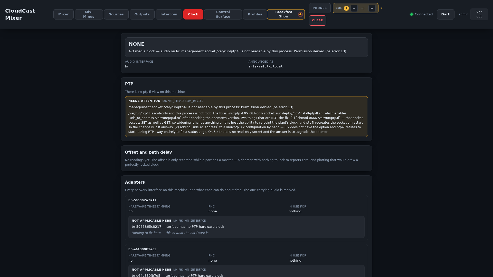

AES67 lives and dies by its media clock, and the **Clock** tab shows what the desk's
clock is actually doing: the PTP port state, interface, timestamping and delay mechanism,
the grandmaster's identity and qualifications (priorities, clock class, accuracy,
variance, time source), offset from master and mean path delay. When the desk cannot make
a conformant claim — no PTP hardware clock, a free-running grandmaster — this panel says
so rather than implying lock. A trend table records recent clock behaviour.

---

## 14. Intercom

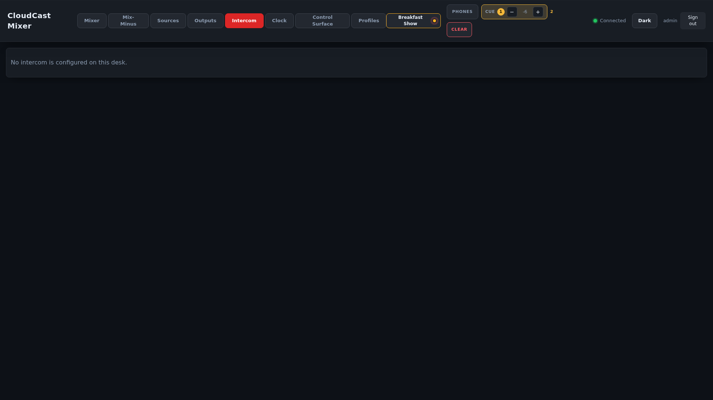

When the deployment wires the desk to a RemoteTalk intercom, the **Intercom** tab is a
key panel: a grid of channels with **TALK** and **LISTEN** keys, tallies for who is
talking, page tabs for larger panels, and a **REC** chip on channels being recorded. The
header's intercom indicator lights for an incoming private call from anywhere in the
surface, and clicking it jumps here. Without an intercom configured the tab reports that
plainly.

---

## 15. Control surfaces

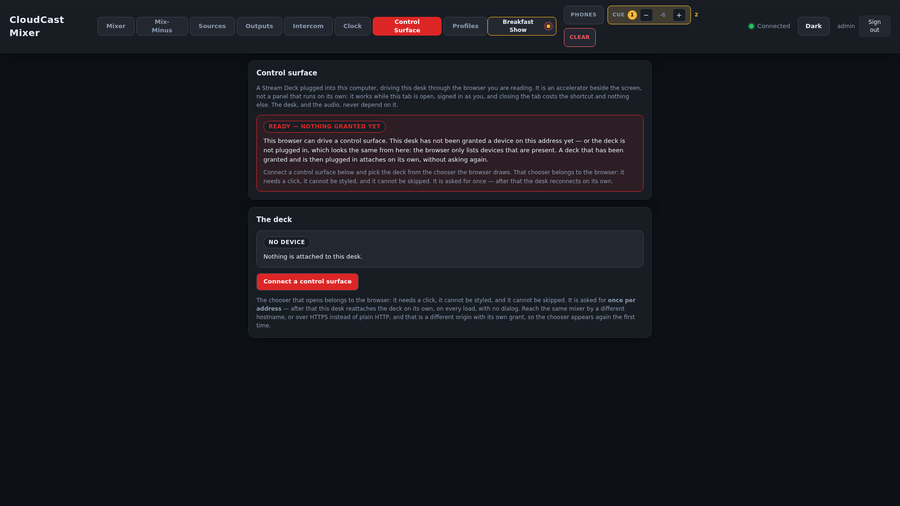

The **Control Surface** tab pairs a physical Stream Deck with the desk over WebHID. The
capability block reports what this browser can do — from **Not in this browser** and
**Not from this address** through **Ready — nothing granted yet** to **Granted** — and
**Connect a control surface** asks the browser to grant a device; **Forget this device**
revokes it. The panel states the mapping in sentences: keys cue channels exactly as the
CUE buttons on the mixer do, and the rotaries follow the desk's selection.

Grants are per-browser and per-address, and WebHID requires a secure context — the
capability block names whichever of these is the obstacle.

---

## 16. The rack panel

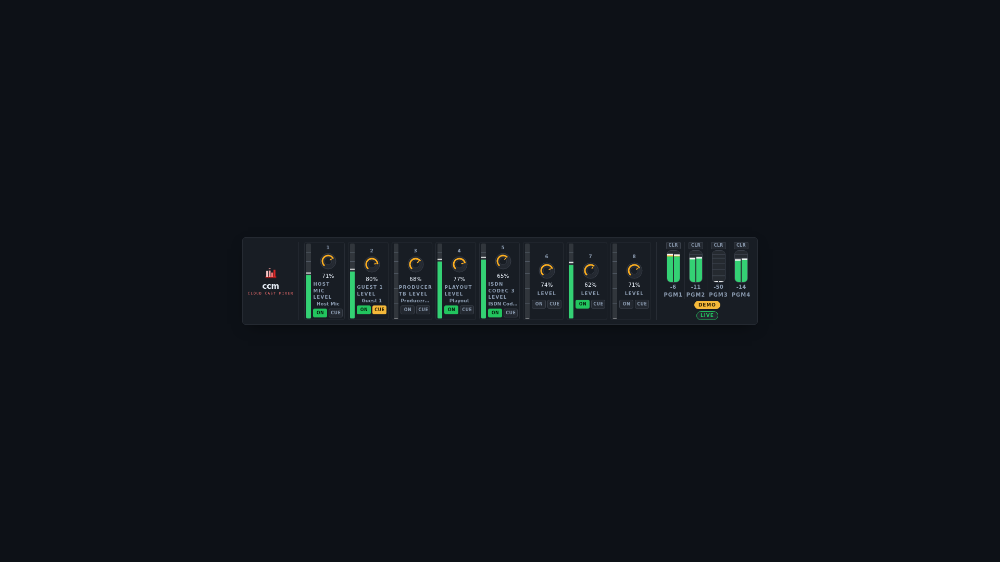

`/panel` is a chrome-free strip built for a rack display or an under-monitor screen:
per-channel level, ON and CUE state, and the four programme meters, with a **LIVE** /
**DOWN** connection pill. URL parameters shape it — `theme`, `width`, `channels`,
`meters`, `controls` — so one bookmark is one panel.

The **DEMO** toggle draws invented levels for demonstrations; its own tooltip is the
contract: **Show invented levels for a demonstration. Nothing on the desk changes.** The
screenshot above is the panel in demo mode.

---

## 17. Accounts, roles and security

Every surface — browser, REST, WebSocket — authenticates. There is no anonymous desk
unless the deployment explicitly enables a read-only or operator panel fallback, and that
fallback is logged loudly at every start.

- **Roles**: an account may read, operate (write), or administer. A signed-in account
  that cannot operate sees the desk with a **read-only** chip and disabled controls.
- **Admin**'s password is set at bootstrap or generated and printed once; change it with
  the API's password endpoint. Accounts are managed over the REST API
  (`/api/auth/users`); there is no user-management panel on the surface.
- Five failed sign-ins lock an account. Sessions expire after 12 hours.
- Every administrative and operational mutation lands in the audit log (`/api/audit`).

---

## 18. Themes

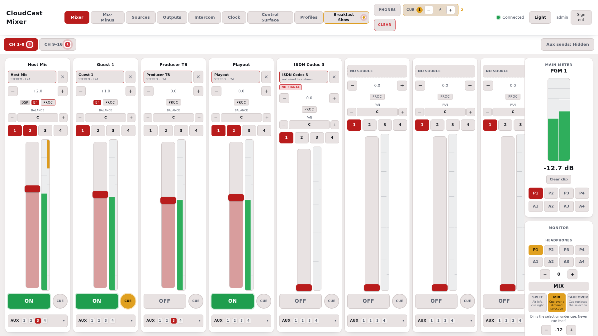

The **Dark** / **Light** toggle in the header switches the desk's own theme. The desk
owns this deliberately — it does not follow the operating system — so a rack display
pinned to dark stays dark whatever the host machine decides.

---

*Manual generated against CloudCast Mixer as of 2026-08-25 (main @ ea6da2c, CCM-1…291).
Screenshots were captured with `build/manual-screenshots.mjs` against a real
`ccmix-server` on the AES67 transport, fed by the repository's `ccmix-testsrc`
identification tone on loopback multicast — every meter shows genuine signal, and the
levels shown are that test signal, not programme. The one exception is §16's rack panel,
photographed in the product's own DEMO mode, which the panel itself labels. The Clock
panel shows the no-PTP state of the capture host; the Intercom panel is shown without a
RemoteTalk connection.*
